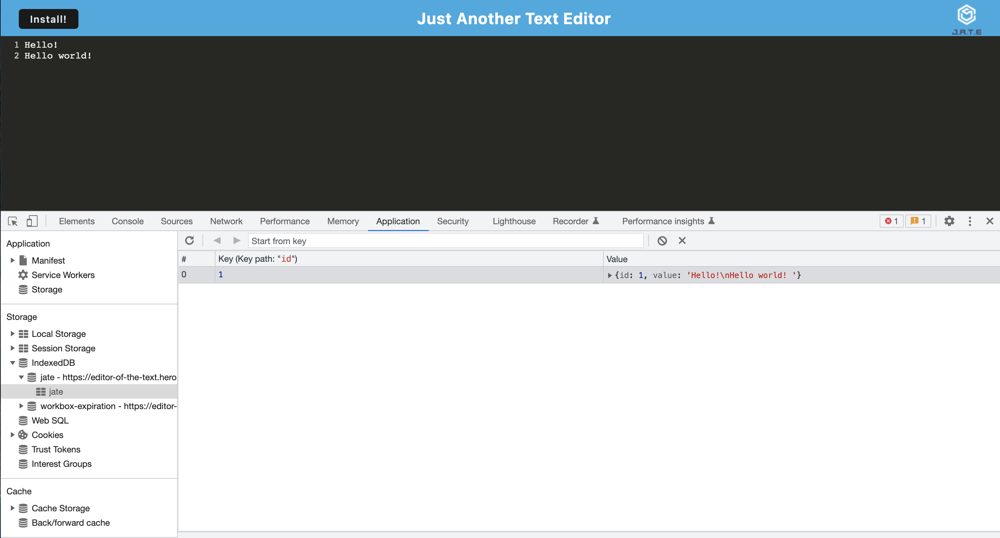

# Editor of the Text

View deployed application [here](https://editor-of-the-text.herokuapp.com/)
## Description

This progressive web application (PWA) is a text editor that runs in the browser and meets the PWA criteria. Additionally, it features a number of data persistence techniques that serve as redundancy in case one of the options is not supported by the browser. The application will also function offline.

This text editor implements methods for getting and storing data to an IndexedDB database. A package called idb is used, which is a lightweight wrapper around the IndexedDB API.

## Table of Contents

- [Installation](#installation)
- [Usage](#usage)
- [License](#license)
- [Contributors](#contributors)
- [Tests](#tests)
- [Questions](#questions)

## Installation
To install the necessary dependencies for this application, open up the terminal at the root then run `npm install`.

## Usage
To deploy the text editor, follow this [link](https://editor-of-the-text.herokuapp.com/). 

To deploy from VS Code, clone the [repo](https://github.com/jmotto/editor-of-the-text.git), install the dependencies, run the command `npm run start`.

To use offline, click the 'install' button at the top corner of the page. 

Here is a screenshot of the text editor showing IndexedDB storage.

## License
This application is licensed under [MIT]((https://opensource.org/licenses/MIT)). 
  Copyright &copy; 2022 Jamie Otto

## Contributors
Jamie Otto

## Tests
Tests are not required.
## Questions
If you have any questions about this project, please contact [jmotto31@gmail.com](mailto:jmotto31@gmail.com). To view more of my projects, go to [jmotto](https://github.com/jmotto).